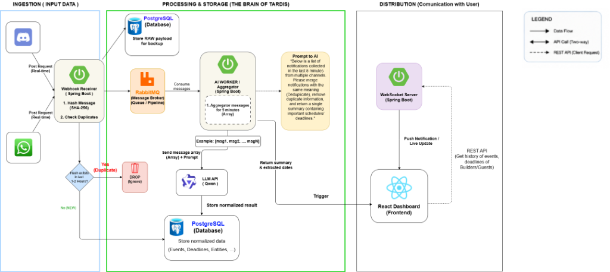

# Little Boy's Tardis - System Architecture

Welcome to the engineering and architectural profile of **Little Boy's Tardis**, the team behind **Tardis**. This document outlines our team roles, development values, and the end-to-end technical system architecture of the Tardis platform.

### Hackathon Metadata

* **Hackathon Submission**: [Tardis on Devpost](https://devpost.com/software/tardis-cypz4k)
* **Hackathon Event**: [Agentic AI Build Week 2026](https://agentic-ai-build-week-2026.devpost.com/resources)
* **Live Demo**: [tardis-hazel.vercel.app](https://tardis-hazel.vercel.app/)

--- ## Our Mission
Our mission is to bridge the communication gap between event organizers (Judges) and developers. By building asynchronous, event-driven architectures combined with state-of-the-art Large Language Models (LLMs), we transform chaotic announcements into structured, real-time actionable intelligence.

--- ## Team Roles & Responsibilities

During this hackathon, our team members took on specific, overlapping roles to ensure a high-quality end-to-end product:

| Name | Devpost | Role | Key Contributions in Tardis |
| :--- | :--- | :--- | :--- |
| **h1eudayne** | [@h1eudayne](https://devpost.com/h1eudayne) | Full-Stack & DevOps Lead | Implemented WebSocket STOMP streaming, Docker Compose, and historical message logging. |
| **hahoangbach2005** | [@hahoangbach2005](https://devpost.com/hahoangbach2005) | Frontend Developer | Created React + TSX client dashboard layouts, CSS styles, and responsive UI containers. |
| **teikv** | [@teikv](https://devpost.com/teikv) | AI & Queue Architect | Configured RabbitMQ exchanges/queues, background consumers, and Qwen-Turbo LLM API client. |
| **an1dee** | [@an1dee](https://devpost.com/an1dee) | Lead Backend Engineer | Developed Spring Boot webhook controllers, REST APIs, and verify-token security validation. |

--- ## System Architecture & Data Flow

Tardis is architected for asynchronous resilience, separation of concerns, and fast response times. The pipeline is broken down into three distinct phases to ensure scalability and zero-latency delivery.



### 1. Ingestion (Input Data)
* **Real-time Webhooks**: Event announcements from **Discord** and **WhatsApp** trigger HTTP POST requests to our Webhook Receiver.
* **Webhook Receiver (Spring Boot)**: Acts as the entry point. It immediately processes incoming payloads.
* **Smart Deduplication (MD5)**: Every message is hashed using MD5. 
  * If the hash already exists `(Yes)`, the message is a cross-platform duplicate and is safely **DROPPED** (Ignored).
  * If it is a new hash `(No)`, the message proceeds to the next phase.

### 2. Processing & Storage (The Brain of Tardis)
* **Raw Backup**: Unprocessed, raw payloads are immediately stored in **PostgreSQL** for data integrity and backup purposes.
* **RabbitMQ (Message Broker)**: Valid messages are pushed to a message queue pipeline. This decouples the fast ingestion layer from the heavy AI processing layer.
* **AI Worker / Aggregator (Spring Boot)**: Consumes messages from RabbitMQ. Instead of overwhelming the LLM with individual pings, the worker **aggregates messages for 5 minutes** into an array `[msg1, msg2, ..., msgN]`.
* **LLM API (Qwen)**: The aggregated array is sent to the Qwen AI with a strict prompt:
  > *"Below is a list of notifications collected in the last 5 minutes from multiple channels. Please merge notifications with the same meaning (Deduplicate), remove duplicate information, and return a single summary containing important schedules/deadlines."*
* **Normalized Storage**: The LLM returns a structured summary and extracted dates. This normalized data (Events, Deadlines, Entities) is permanently stored in **PostgreSQL**.

### 3. Distribution (Communication with User)
* **WebSocket Server (Spring Boot)**: Once the normalized result is saved, it triggers the WebSocket server.
* **Push Notification (Live Update)**: The server pushes the summarized data instantly to the **React Dashboard (Frontend)** with zero latency.
* **REST API**: The React client can also make standard REST API requests to fetch the historical timeline of events, deadlines, and past summaries for Builders and Guests.

--- ## Technology Stack Detail

| Category | Technology | Detail / Purpose |
| :--- | :--- | :--- |
| **Backend Core** | Spring Boot 3.x, Java 21 | High performance REST, DI, and thread pools |
| **Message Broker** | RabbitMQ | Reliability, durability, and async decoupling |
| **Database** | PostgreSQL / H2 | Relational persistent store (PostgreSQL) / Memory test DB (H2) |
| **Realtime Stream** | WebSockets (STOMP Protocol) | Lightweight live updates pushing |
| **LLM Engine** | Qwen-Turbo (Alibaba DashScope) | Text analytics, bullet extraction, tagging, classification |
| **Frontend** | React 18, Vite, TypeScript | SPA framework, strict type definitions, speed |
| **Icons & Style** | Lucide React, CSS variables | Dashboard aesthetics, dark mode design system |

--- ## Codebase Directory Structure

```bash
Tardis/
 .github/                  # GitHub specific metadata
    README.md             # Systems architecture & Team profile
 backend/                  # Spring Boot backend source files
    src/                  # Main & test source packages
    pom.xml               # Maven configuration
    README.md             # Backend tech notes
 frontend/                 # React SPA source files
    src/                  # Components, styles, assets
    package.json          # Node configuration
    README.md             # Frontend tech notes
 docker-compose.yml        # Multi-container orchestration (Postgres, RabbitMQ)
 test_scenarios.md         # Simulated API payload definitions
 README.md                 # Main user guide & test manual
```
